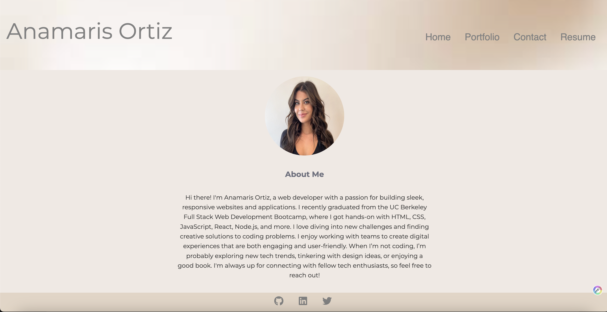

# React Portfolio

Welcome to my React portfolio! This project showcases my skills in web development and features a variety of projects I have worked on.

## Deployed Site

You can view my live portfolio [here](https://anamarisortiz-portfolio.netlify.app/).



## Features

- **Project Showcase**: Each project includes a description, technologies used, and a link to the live demo and source code.
- **Interactive UI**: The user interface is interactive and engaging, providing a seamless experience.

## Technologies Used

- React
- HTML
- CSS
- JavaScript


## Installation

To run this project locally:

1. Clone the repository:
   ```bash
   git clone https://github.com/your-username/React-Portfolio.git

2. Navigate to the project directory 
    ``` cd React-Portfolio

3. Install dependecies
    ``` npm install 

4.  Start dev server
    ``` npm run dev

## License

This project is licensed under the MIT License. 

You are free to use, copy, modify, merge, publish, distribute, sublicense, and/or sell copies of the Software, provided that the following conditions are met:

- The above copyright notice and this permission notice shall be included in all copies or substantial portions of the Software.
- THE SOFTWARE IS PROVIDED "AS IS", WITHOUT WARRANTY OF ANY KIND, EXPRESS OR IMPLIED, INCLUDING BUT NOT LIMITED TO THE WARRANTIES OF MERCHANTABILITY, FITNESS FOR A PARTICULAR PURPOSE AND NONINFRINGEMENT. IN NO EVENT SHALL THE AUTHORS OR COPYRIGHT HOLDERS BE LIABLE FOR ANY CLAIM, DAMAGES OR OTHER LIABILITY, WHETHER IN AN ACTION OF CONTRACT, TORT OR OTHERWISE, ARISING FROM, OUT OF OR IN CONNECTION WITH THE SOFTWARE OR THE USE OR OTHER DEALINGS IN THE SOFTWARE.

For more information, see the [LICENSE](LICENSE) file in this repository.


This template provides a minimal setup to get React working in Vite with HMR and some ESLint rules.

Currently, two official plugins are available:

- [@vitejs/plugin-react](https://github.com/vitejs/vite-plugin-react/blob/main/packages/plugin-react/README.md) uses [Babel](https://babeljs.io/) for Fast Refresh
- [@vitejs/plugin-react-swc](https://github.com/vitejs/vite-plugin-react-swc) uses [SWC](https://swc.rs/) for Fast Refresh
# React-Portfolio
